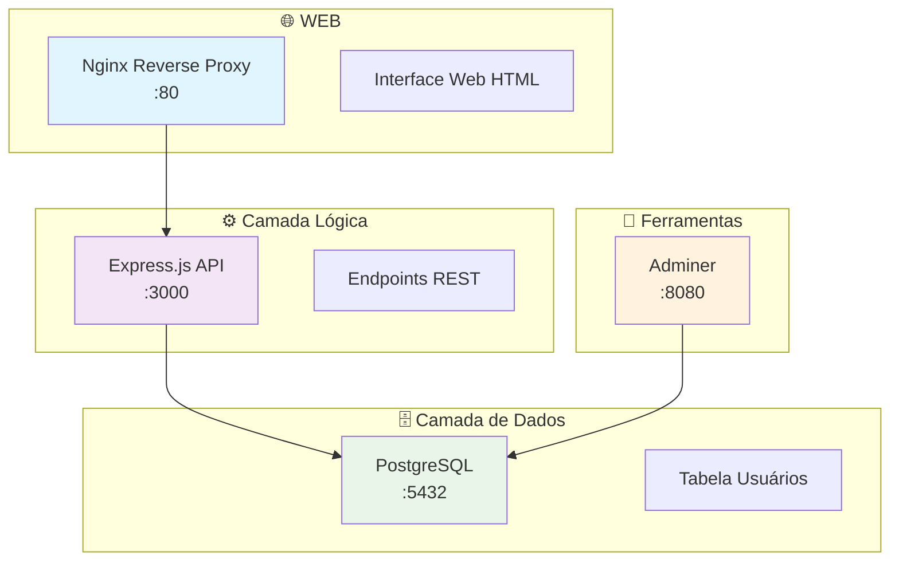

# 🌐 Sistema de Usuários

[](https://www.docker.com/)
[](https://nodejs.org/)
[](https://www.postgresql.org/)
[](https://nginx.org/)

> 📋 **Aplicação web completa demonstrando arquitetura 3-camadas com containerização Docker, implementando sistema de gerenciamento de usuários com API REST e persistência de dados.**

## 🏗️ Arquitetura do Sistema



## ✨ Características Principais

- 🐳 **100% Containerizado** - Deploy completo com Docker Compose
- 🔄 **Arquitetura 3-Camadas** - Separação clara de responsabilidades
- 🚀 **API REST Completa** - CRUD de usuários com validações
- 🔐 **Conexão Segura** - Pool de conexões PostgreSQL
- ⚡ **Proxy Reverso** - Nginx com balanceamento e health checks
- 📊 **Interface de Administração** - Adminer para gerenciar dados
- 🔍 **Health Monitoring** - Endpoints de status e verificação
- 🌍 **Variáveis de Ambiente** - Configuração flexível

## 🚀 Quick Start

### Pré-requisitos
- Docker e Docker Compose instalados
- Portas 80, 3000, 5432, 8080 disponíveis

### 1️⃣ Clonar e Iniciar
```bash
# Clonar o repositório
git clone <repository-url>
cd projeto-redes2

# Iniciar todos os serviços
docker-compose up -d

# Verificar status dos containers
docker-compose ps
```

### 2️⃣ Verificar Funcionamento
```bash
# API Status
curl http://localhost/api/status

# Listar usuários
curl http://localhost/api/usuarios

# Interface web
# Abrir http://localhost no navegador

# Adminer (gerenciar banco)
# Abrir http://localhost:8080 no navegador
```

## 📡 API Endpoints

| Método | Endpoint | Descrição | Exemplo de Body |
|--------|----------|-----------|-----------------|
| `GET` | `/` | 📖 Documentação da API | - |
| `GET` | `/api/status` | ❤️ Status da conexão | - |
| `GET` | `/api/usuarios` | 👥 Listar todos os usuários | - |
| `GET` | `/api/usuarios/:id` | 👤 Buscar usuário por ID | - |
| `POST` | `/api/usuarios` | ➕ Criar novo usuário | `{"nome": "João", "email": "joao@email.com"}` |
| `DELETE` | `/api/usuarios/:id` | ❌ Remover usuário | - |

### 💡 Exemplos de Uso

```bash
# Criar usuário
curl -X POST http://localhost/api/usuarios \
  -H "Content-Type: application/json" \
  -d '{"nome": "Maria Silva", "email": "maria@email.com"}'

# Buscar usuário específico
curl http://localhost/api/usuarios/1

# Remover usuário
curl -X DELETE http://localhost/api/usuarios/1
```

## 🔧 Configuração e Personalização

### Variáveis de Ambiente

Crie um arquivo `.env` na raiz do projeto:

```env
# Configurações do Banco de Dados
DB_NAME=meuapp
DB_USER=admin
DB_PASSWORD=senha123

# Configuração da Aplicação
PORT=3000
```

### Estrutura de Diretórios

```
projeto-redes2/
├── 🐳 docker-compose.yml      # Orquestração dos containers
├── 📁 app/                    # Aplicação Node.js
│   ├── 🐳 Dockerfile         # Build da aplicação
│   ├── 📦 package.json       # Dependências Node.js
│   └── 🚀 server.js          # Servidor Express
├── 📁 nginx/                  # Proxy reverso
│   ├── 🐳 Dockerfile         # Build do Nginx
│   ├── ⚙️ nginx.conf         # Configuração proxy
│   └── 📁 html/              # Arquivos estáticos
└── 📁 init.sql/              # Scripts inicialização BD
```
